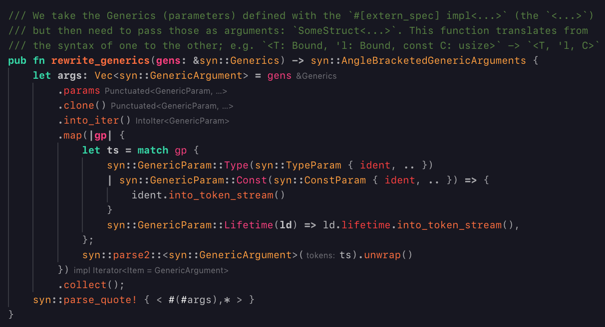
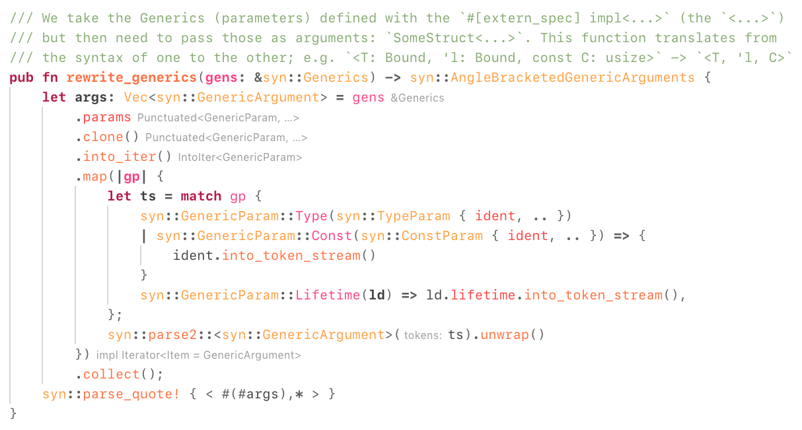

# Clarity Theme Pair

This is a set of two themes, Clarity Bright and Clarity Mellow, providing a coherent theme across light and dark mode. Pictures are worth 1000 words, so:

## Clarity Mellow

## Clarity Bright

## Setup

I haven't submitted this extension to the VS Code Marketplace or anything, so you'll have to install it yourself. Currently the easiest way to do that seems to be to clone or download the repo to `.vscode/extensions/` in your home folder, or whatever the equivalent of that place is on your platform.

## Caveats

This is just a personal project, so it may well be that you run into issues with certain languages I don't use myself. Feel free to report issues or open PRs, but don't expect the world lol
